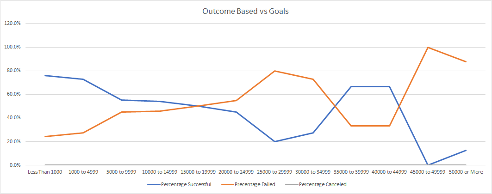

# An Analysis of Kickstarter Campaigns.
## Overview of Project
##### The intent of this project was to inspect donor behaviors in order to maximize the chances for funding a play.  Aggergated Kickstarter donotion data from 2009 forward was made available for analysis.  This data was managed into an analyis that leads to the conclusions around timing and overall funding.  The data set for these conclusions are named 'Outcomes Based on Launch Date Chart' and 'Outcomes Based on Goals Chart' within the Kickstarter Excel.

## Analysis and Challenges

##### The first point of interest was whether there was a time of year that could be identified where donnors were more likely contribute to the theater arts.  Month over Month data from year 2009 to 2017 was aggergated to yeild the following trends in succeful outcome for theater plays.

