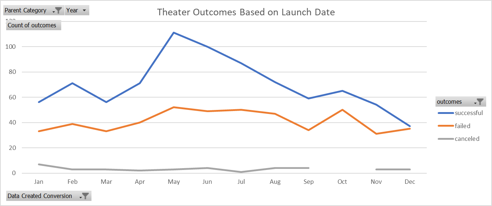

# An Analysis of Kickstarter Campaigns.
## Overview of Project
##### The intent of this project was to inspect donor behaviors to maximize the chances for funding a play. Aggregated Kickstarter donation data from 2009 forward to 2017 was made available for analysis. This data was managed into an analysis that leads to the conclusions around timing and overall funding.  The data set for these conclusions are named 'Outcomes Based on Launch Date Chart' and 'Outcomes Based on Goals Chart' within the Kickstarter Excel.

## Analysis and Challenges

##### The first point of interest was whether there was a time of year that could be identified where donors were more likely contribute to the theater arts. Month-over-Month data from year 2009 to 2017 was aggregated to yield the following trends in successful outcomes for theater plays. From the data it appears that summer months tend to capture the largest number of donors. This may be a response to better weather and outdoor plays. That being stated further filtering of countries that lay in the North Hemisphere or Southern Hemisphere may yield further insight.

##### Another point to the timing of request for endowments is that there is also a small increase in the amount of failed efforts during the summer months. This may lead to the conclusion that there is a known “donor season”.

##### As to the question of price point in the production of plays there seems to be clear data in that regard. As the price point of a play increases the chances of it failing increase as well. However, there is one area of outlier where higher priced plays can still be made.

##### Lastly, the current pricing data is problematic. All of the funding is priced in its home country’s currency.  The currency value can very widely from country to country and pain points for cost may vary widely from country to country as well. It would be recommended that cost evaluation be limited to the country of interest or at least to countries with similar currency values. This could be achieved by adding an additional column of data that converts all countries currency to a year current mean value and then converted to USD.

##  Results
##### Overall, given the current filtering requirements, the best month to seek patron’s endowments are in May with the summer months (May, June, and July) seemingly the most productive.

##### Financially, plays made for under $5000 have almost and 80% chance of success with a steady decline in support from that price point up.  Between $15,000 and $19,999 there is a fifty percent chance to meet the goals of the play and sharp decline after that. However, there is one outlier in the data. Plays that are made in the range of $35,000 to $44,999 have a 70% chance of being produced while anything above that price point has little chance to every make the stage.

